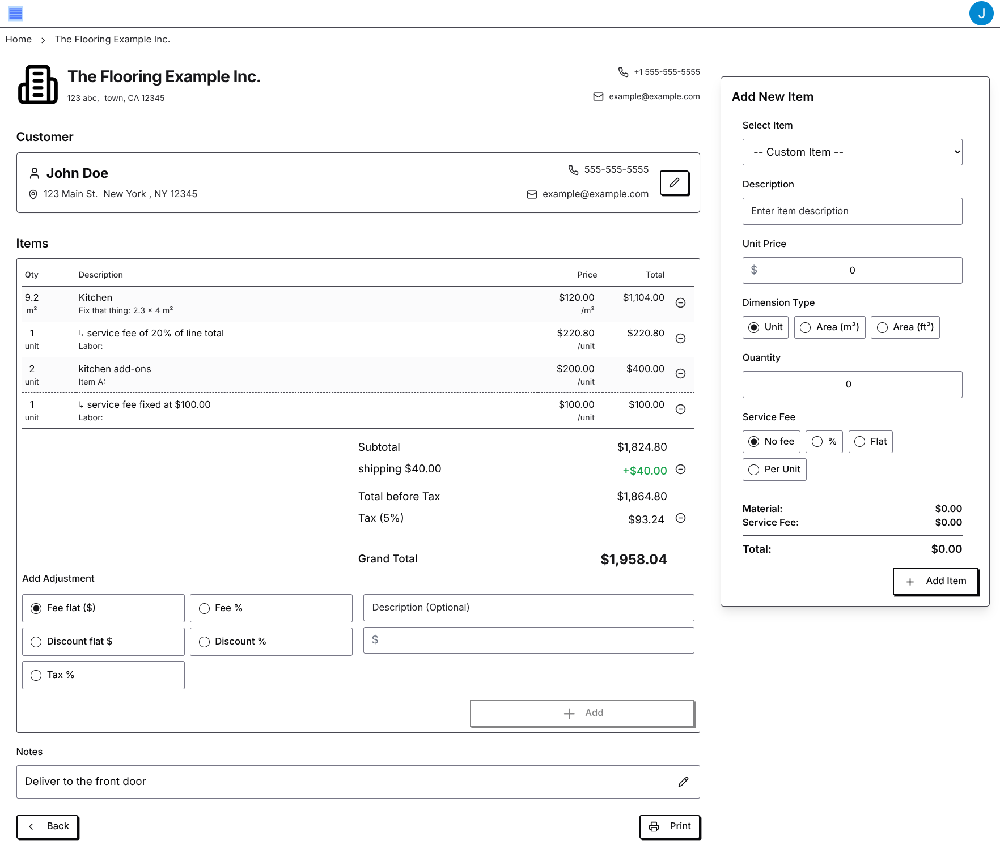
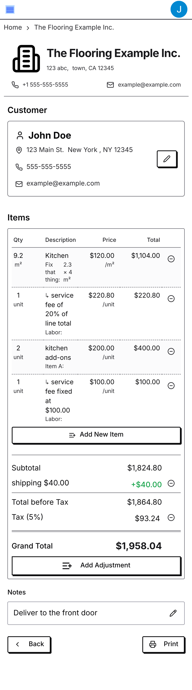

# Simple Journal App

This is a simple journal app that allows users to create and manage different types of journals and collaborate with others.

## Screenshots

**Desktop:**

**Phone:**

## Example Output

You can view an example PDF output here: [Example Quote PDF](example.pdf)

## Supported Journal Types

Currently, the application supports the following journal types:

*   **Cashflow:** For tracking income and expenses, with entries including details like description, date, type (received/paid), value, and currency.
*   **Quote:** For creating and managing quotes with detailed line items (based on materials and labor), adjustments (like tax, discounts), customer and supplier contact information, and status tracking.

The project structure and schema definitions (e.g., `InventorySchema.ts`) also indicate the underlying data structures to support managing reusable material and labor items, integral to the Quote journal type and potentially evolving into a standalone inventory management feature.

## Features

*   **Journal Creation and Management:** Create and manage different types of journals.
*   **Entry Management:** Add, edit, and remove entries specific to each journal type (e.g., cash flow transactions, quote line items).
*   **Collaboration:** Share journals with other users and define their access levels.
*   **Role-Based Access Control:** Assign roles (Admin, Editor, Staff, Viewer) to collaborators to control their permissions within a journal.
*   **Search Functionality:** Search for journals and entries using filters like date ranges and keywords. Date range filtering is supported.
*   **Reporting:** Generate reports based on journal data (specific reports may vary by journal type, e.g., cash flow summaries, quote totals).
*   **Data Export:** Export journal data, currently supporting export to CSV format (e.g., quote details or cash flow entries).

### Roles

*   **Admin:** Has full administrative control over the journal, including managing entries, collaborators, and settings.
*   **Editor:** Can add, edit, and delete journal entries.
*   **Staff:** Can add new journal entries.
*   **Viewer:** Can only view journal entries and reports.

## Data Model and Firestore Structure

The application utilizes Firestore to store journal data. The data model is structured around journals, entries within journals, and supporting collections for entities like inventory items and customers.

The primary collections and document structures, based on the project's schema definitions, are:

*   `/journals`: This collection holds the main documents for each journal.
    *   **Journal Document (`/journals/{journalId}`):**
        *   `title` (string): The name of the journal.
        *   `journalType` (string): Indicates the type of journal (e.g., `"cash-flow"`, `"quote"`).
        *   `createdAt` (timestamp): The time the journal was created.
        *   `updatedAt` (timestamp): The time of the last update to the journal document.
        *   `access` (map): Defines the access levels for collaborators. Keys are user IDs, and values are objects containing user details and their assigned `role` (`"admin"`, `"editor"`, `"staff"`, `"viewer"`).
        *   `pendingAccess` (map): Stores pending invitations to collaborate, mapping email addresses to intended roles.
        *   `details` (object): Contains type-specific data for the journal.
            *   If `journalType` is `"quote"`, the `details` object conforms to the `quoteDetailsStateSchema`, including fields like `confirmedItems` (an array of line items), `status` (`"pending"`, `"accepted"`, `"rejected"`), `customer` (`contactInfoSchema`), `supplier` (`contactInfoSchema`), `logo`, `adjustments` (array of `adjustmentSchema`), `taxPercentage`, `currency` (`currencyCodeSchema`), and `notes`.

*   `/journals/{journalId}/entries`: This subcollection contains the individual entries for a specific journal.
    *   **Cashflow Entry Document (`/journals/{journalId}/entries/{entryId}`):** Represents a single cash flow transaction, conforming to `cashFlowEntryDetailsSchema`. It includes fields like `createdAt`, `createdBy`, `date`, `description`, `type` (`"received"` or `"paid"`), `value`, and `currency`.
    *   **Quote Line Item Document (`/journals/{journalId}/entries/{entryId}`):** Represents a single item or service on a quote, conforming to `lineItemSchema` (which includes `materialItemSchema`). It includes fields like `id`, `parentId`, `quantity`, optional `dimensions`, `description`, `createdAt`, and nested `material` details (like `unitPrice`, `dimensions`, `currency`).

*   `/inventory` (Inferred): A likely collection for managing reusable `materialItemSchema` and `laborItemSchema` documents, referenced by Quote line items.

*   `/customers` (Inferred): A likely collection for storing customer contact information, referenced by Quote journals using the `contactInfoSchema`.

*(Note: This structure is based on the project's schema definitions and file organization. The actual implementation might have minor variations in collection naming or data relationships.)*

## Development Status

The project is currently under active development.
